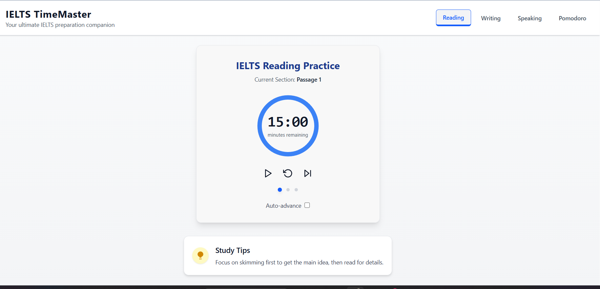

# IELTS TimeMaster — React + Vite

A minimal and customizable timer app designed specifically for IELTS practice. Built with React and Vite to deliver a smooth development experience and lightning-fast hot module replacement (HMR).

## 🚀 Features

- Structured IELTS timers tailored for Reading, Writing, Speaking, and Pomodoro study modes.
- Multi-phase timers (e.g., Reading mode divided into 15, 20, and 20-minute passages).
- Clean, responsive UI with intuitive controls: Start, Pause, Reset, and Next.

## ⚙️ Tech Stack

- **React** — UI library
- **Vite** — Fast build tool and development server with HMR
- **Tailwind CSS** — Utility-first CSS framework for styling
- **JavaScript** — Plain JS for logic and interaction

## 📸 Screenshot

## 📦 Getting Started

### Prerequisites

- Node.js v14 or higher
- npm package manager

### Installation

# Clone the repository
git clone https://github.com/Saisha-JSX/IELTS-TimeMaster.git
cd IELTS-TimeMaster

# Install dependencies
npm install

### Running the Development Server
npm run dev

Open your browser and navigate to http://localhost:5173 to view the app.

### 🙏 Acknowledgments
Inspired by IELTS preparation needs and Pomodoro productivity techniques.